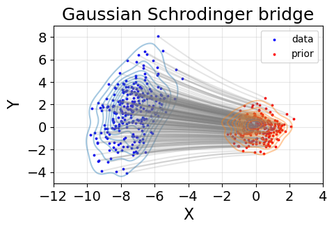
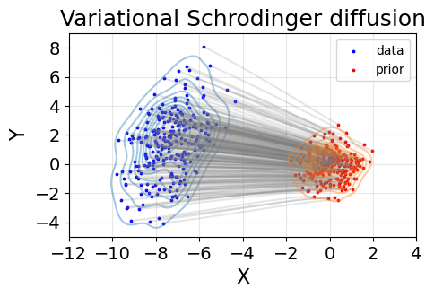

# Variational Schrodinger Diffusion Models

### This version is a stable implementation of the time-invariant variational scores. The time-variant version is studied in another branch.

## Installation

Following the [link](https://github.com/ghliu/SB-FBSDE), we can install the environment `vsd` using [Anaconda](https://www.anaconda.com/products/individual) as follows
```bash
conda env create --file requirements.yaml python=3
conda activate vsd
```

## Section 1: Consistency check w.r.t. Gaussian Schrodinger bridge

We set beta-r as 0 to fix the hyperparameters of the VP-SDE. We choose $\zeta=1$ in Eqn.(6) since the duality is attainable.

```python
python main.py --problem-name gaussian --num-stage 20 --forward-net Linear --dir gaussian_vsdm_4 --beta-max 4 --beta-r 0. --interact-coef 1
```


<p float="left">
  
   
</p>

## Section 2: Simulation Data (1X on X-axis and 8X on Y-axis)

### Section 2.1: Generation of Non-isotropic shapes
#### DSM (beta 10 fails)

```python
python main.py --problem-name spiral --num-itr-dsm 100000 --dir spiral_8y_dsm_10 --y-scalar 8 --beta-max 10 --DSM-baseline
```

```python
python main.py --problem-name checkerboard --num-itr-dsm 100000 --dir check_6x_dsm_10 --x-scalar 6 --beta-max 10 --DSM-baseline
```

#### DSM (beta 20 works, but transport is weak)

```python
python main.py --problem-name spiral --num-itr-dsm 100000 --dir spiral_8y_dsm_20 --y-scalar 8 --beta-max 20 --DSM-baseline
```

```python
python main.py --problem-name checkerboard --num-itr-dsm 100000 --dir check_6x_dsm_20 --x-scalar 6 --beta-max 20 --DSM-baseline
```

#### VSDM (beta 10 works via adaptive learning)
```python
python main.py --problem-name spiral --num-itr-dsm 500 --num-stage 200 --forward-net Linear \
               --dir spiral_8y_vsdm_10 --y-scalar 8 --beta-max 10 
```

```python
python main.py --problem-name checkerboard --num-itr-dsm 500 --num-stage 200 --forward-net Linear   \
             --dir check_6x_vsdm_10 --x-scalar 6 --beta-max 10 
```

### Section 2.2: Generation with fewer number of function evaluations (NFEs)

The current code only support NFE=6 (setting interval 108) and 8 (interval 128).

```python
python main.py --problem-name spiral --num-itr-dsm 100000 --dir spiral_dsm_nfe_6 --y-scalar 8 --DSM-baseline --nfe 6
python main.py --problem-name checkerboard --num-itr-dsm 100000 --dir check_dsm_nfe_6 --x-scalar 6 --DSM-baseline --nfe 6 
```

```python
python main.py --problem-name spiral --num-itr-dsm 500 --num-stage 200 --forward-net Linear --dir spiral_vsdm_nfe_6 --y-scalar 8 --interact-coef 0.85 --nfe 6
python main.py --problem-name checkerboard --num-itr-dsm 500 --num-stage 200 --forward-net Linear  --dir check_vsdm_nfe_6 --x-scalar 6  --interact-coef 0.85 --nfe 6
```


### Acknowledgement

https://github.com/ghliu/SB-FBSDE
